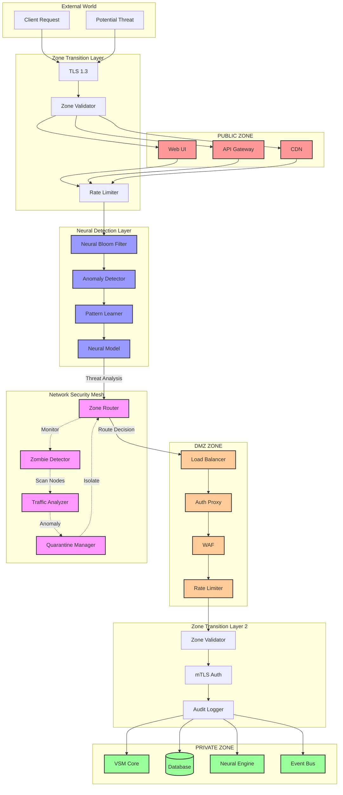
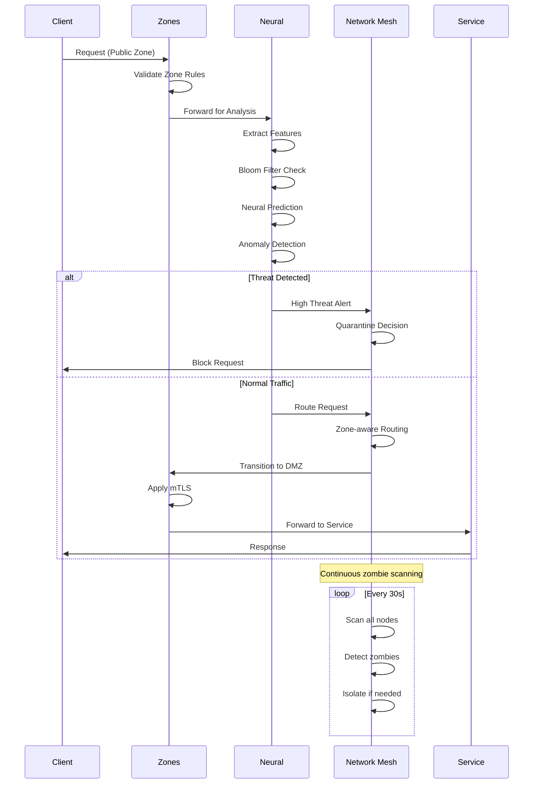
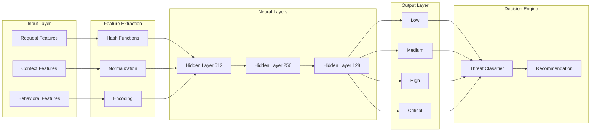
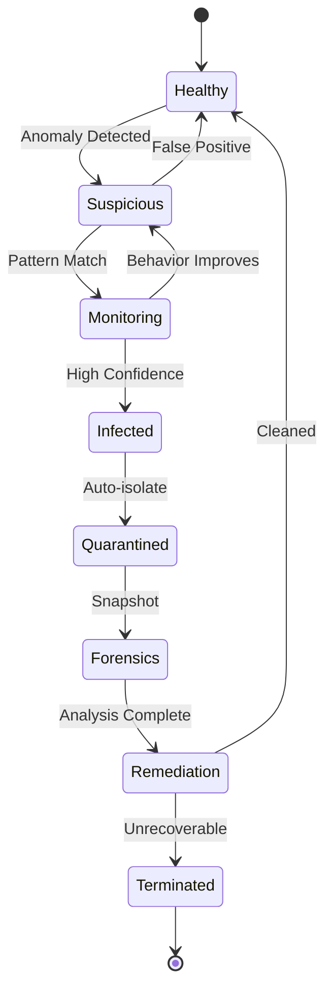
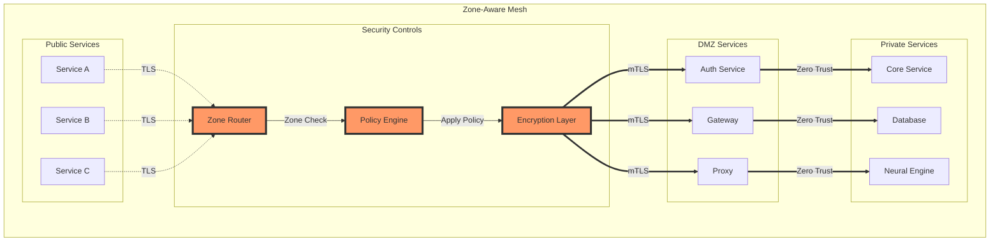

# Z3N Security Architecture - Visual Diagram

## Complete Z3N Security Flow



## Z3N Component Interaction



## Neural Network Architecture



## Zombie Detection State Machine



## Security Mesh Topology



## Performance Metrics Dashboard

```
┌─────────────────────────────────────────────────────────────┐
│                    Z3N Security Dashboard                    │
├─────────────────────────────────────────────────────────────┤
│                                                             │
│  Zone Health         Neural Status        Network Status    │
│  ┌─────────────┐    ┌─────────────┐    ┌─────────────┐   │
│  │ Public: 98% │    │ Model v42   │    │ Routes: 1.2k│   │
│  │ DMZ:   100% │    │ Accuracy:   │    │ Blocked: 23 │   │
│  │ Private:95% │    │   99.7%     │    │ Zombies: 0  │   │
│  └─────────────┘    └─────────────┘    └─────────────┘   │
│                                                             │
│  Request Flow                     Threat Distribution       │
│  ┌─────────────────────────┐    ┌─────────────────────┐   │
│  │ ▁▃▅▇█▇▅▃▁▁▃▅▇█▇▅▃▁ │    │ Low:      ████ 78%  │   │
│  │ 12k req/s              │    │ Medium:   ██   15%  │   │
│  └─────────────────────────┘    │ High:     █    6%   │   │
│                                  │ Critical: ▌    1%   │   │
│  Latency Analysis                └─────────────────────┘   │
│  ┌─────────────────────────┐                               │
│  │ Zone Check:    <1ms    │    Active Quarantines: 0      │
│  │ Neural:       <10ms    │    Cache Hit Rate:    94%     │
│  │ Routing:       <2ms    │    Model Updates:     12      │
│  └─────────────────────────┘                               │
└─────────────────────────────────────────────────────────────┘
```

## Implementation Priority

1. **Phase 1: Zone Infrastructure**
   - Implement zone boundaries
   - Setup TLS/mTLS
   - Basic routing rules

2. **Phase 2: Neural Detection**
   - Deploy Bloom filters
   - Train initial models
   - Integrate anomaly detection

3. **Phase 3: Network Mesh**
   - Implement zombie detection
   - Setup traffic analysis
   - Deploy quarantine system

4. **Phase 4: Integration**
   - Connect all components
   - Performance optimization
   - Monitoring dashboard